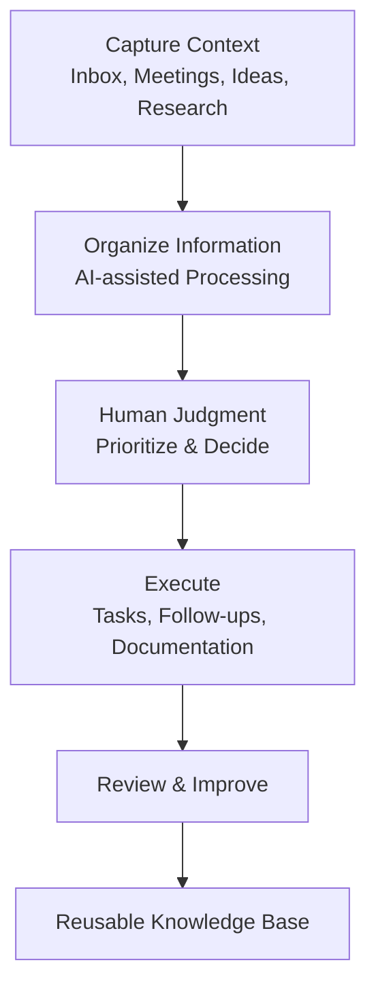

# Founder Operating System

An AI-assisted operating system for turning context into execution.

This repository documents the workflows I use to reduce cognitive load, organize information, and keep projects moving.

AI helps accelerate information processing.

Human judgment connects context, sets priorities, and drives execution.

---

## Core Principles

- Capture context once.
- Organize before acting.
- AI accelerates.
- Human judgment decides.
- Build systems that reduce repeated work.

---

# Workflows

## Information Management

📥 [Inbox Triage](workflows/inbox-triage.md)

Transform incoming information into prioritized actions and follow-ups.

---

## Execution & Follow-through

📝 [Meeting Follow-up](workflows/meeting-followup.md)

Turn conversations into decisions, ownership, and execution.

---

## Research & Decision Support

🔎 [Research Workflow](workflows/research.md)

Transform complex information into structured insights and decision briefs.

---

# Templates

Reusable structures for consistent execution.

📄 [Meeting Template](templates/meeting-template.md)

📄 [Decision Log](templates/decision-log.md)

📄 [Project Tracker](templates/project-tracker.md)

---

# Example

🧩 [Meeting to Execution Example](examples/sample-meeting.md)

A demonstration of how discussions can become structured decisions and actions.

---

## Philosophy

AI is my starting point, not my replacement for thinking.

The goal is not to automate judgment, but to create better systems for making decisions and moving meaningful work forward.
