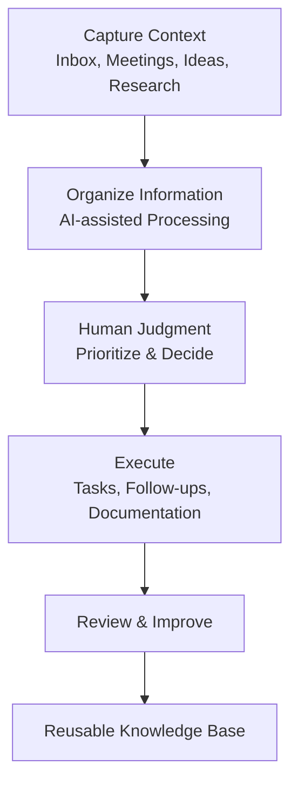

# Founder Operating System

An AI-assisted operating system for turning context into execution.

This repository documents the workflows I use to reduce cognitive load, organize information, and keep projects moving.

AI helps me process information faster.

Human judgment connects context, sets priorities, and drives execution.

## Core Principles

- Capture context once.
- Organize before acting.
- AI accelerates.
- Human judgment decides.
- Build systems that reduce repeated work.

## Current Workflows

- Inbox triage
- Meeting follow-up
- Research synthesis

More workflows will be added over time.
